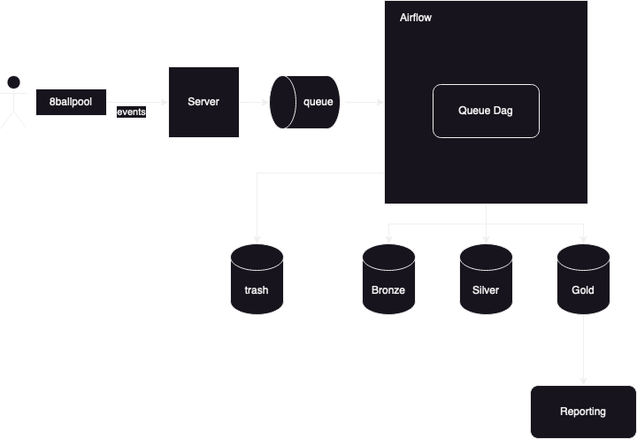
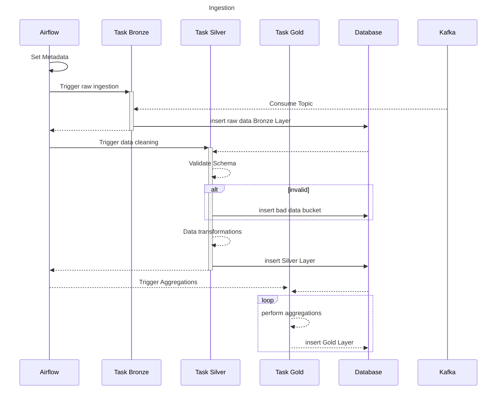

# Pipeline Architecture

## High Level Design

Airflow for orchestration.
Dag to be instanced in separate Spark infrastucture

## Pipeline

```mermaid
---
title: Ingestion
---
sequenceDiagram
    participant A as Airflow
    participant T1 as Task Bronze
    participant T2 as Task Silver
    participant T3 as Task Gold
    participant DB as Database
    participant K as Kafka

    A->>A: Set Metadata
    A->>+T1: Trigger raw ingestion
    K-->>T1: Consume Topic
    T1->>DB: insert raw data Bronze Layer
    T1-->>-A: 
    A->>+T2: Trigger data cleaning
    DB-->>T2: 
    T2-->>T2: Validate Schema
    alt invalid
    T2->>DB: insert bad data bucket
    end
    T2-->>T2: Data transformations
    T2->>DB: insert Silver Layer
    T2-->>-A: 
    A-->>+T3: Trigger Aggregations
    DB-->>T3: 
    loop
        T3-->>T3: perform aggregations
        T3-->>DB: insert Gold Layer
    end
```
