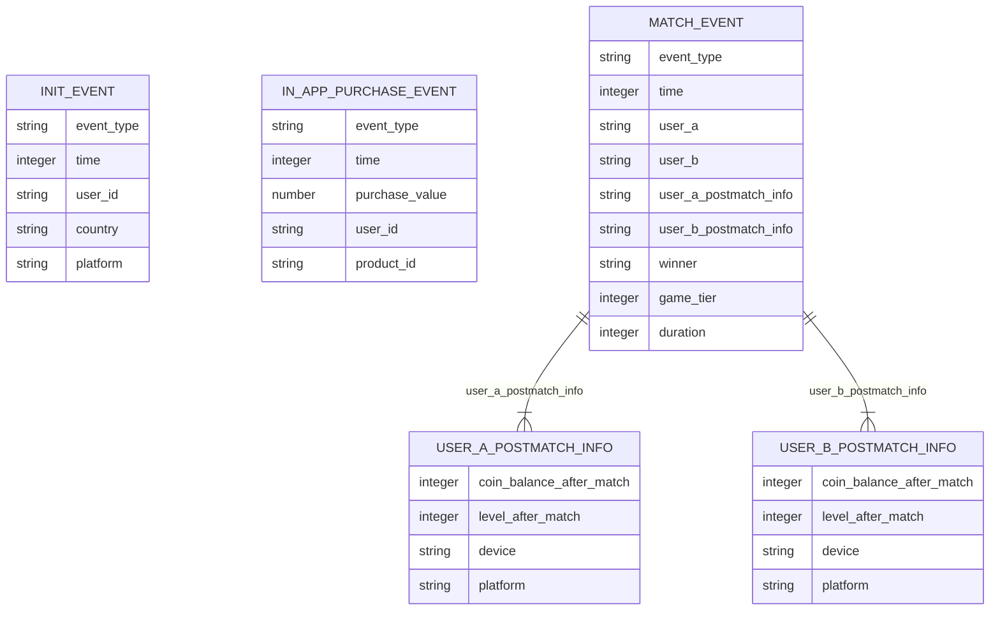

```mermaid
erDiagram
    %% Init Event
    INIT_EVENT {
        string event_type
        integer time
        string user_id
        string country
        string platform
    }

    %% In-app Purchase Event
    IN_APP_PURCHASE_EVENT {
        string event_type
        integer time
        number purchase_value
        string user_id
        string product_id
    }

    %% Match Event
    MATCH_EVENT {
        string event_type
        integer time
        string user_a
        string user_b
        string user_a_postmatch_info
        string user_b_postmatch_info
        string winner
        integer game_tier
        integer duration
    }

    %% User A Post-Match Info
    USER_A_POSTMATCH_INFO {
        integer coin_balance_after_match
        integer level_after_match
        string device
        string platform
    }

    %% User B Post-Match Info
    USER_B_POSTMATCH_INFO {
        integer coin_balance_after_match
        integer level_after_match
        string device
        string platform
    }

    %% Relationships
    MATCH_EVENT ||--|{ USER_A_POSTMATCH_INFO : user_a_postmatch_info
    MATCH_EVENT ||--|{ USER_B_POSTMATCH_INFO : user_b_postmatch_info
```
